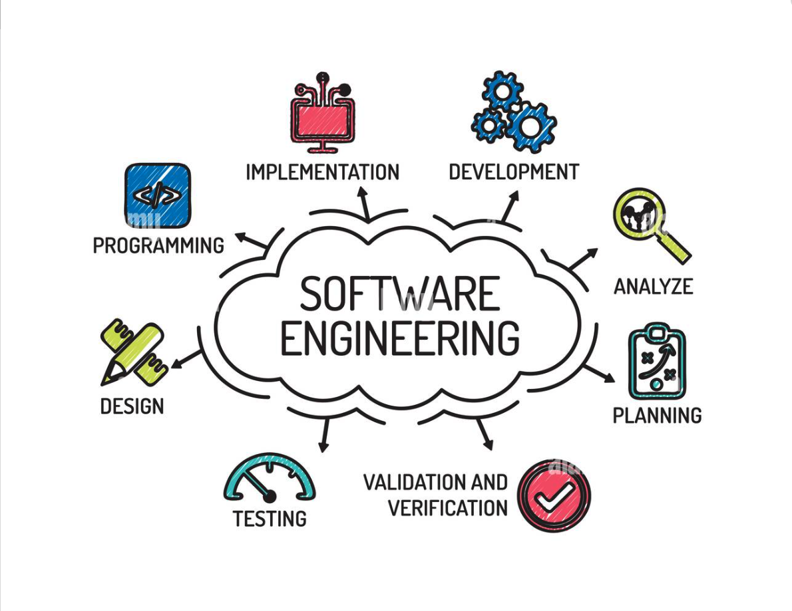

#  
## How are you doing today? I'm Kenneth P. Chang. My nickname is Kenjamin Button.  😊 

🙏 Thank you for visiting my GitHub profile! 

💻 Full-Stack Software Engineer with over 10+ years of experience

## 🚀💻 Technologies & Tools

### <u> Languages: </u>

 

  

  

  

  

  

  

  

  

  

### <u> Frontend Development Technologies and Tools: </u>

 

### <u> Backend Development + Database + DevOps + Deployment Technologies & Tools: </u>

 

### <u> Mobile App Development Technologies & Tools: </u>

 

### <u> Version Control and Tools:</u>

 

### <u> Operating Systems and Others:</u>

 

 
 

<i> Recently, I've also been learning: </i>

&nbsp;

 

## Contact Me 💬

 

  
  
  
  

 

 

-----
Credits: [Kenneth P. Chang](https://www.kenjaminbutton.com)

Last Edited on: 11/25/2024
